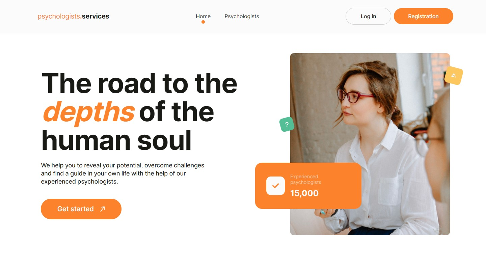
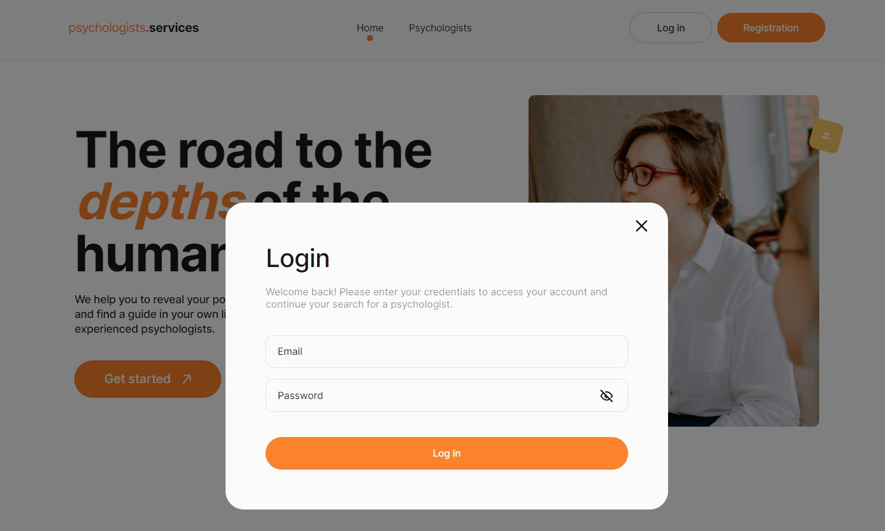
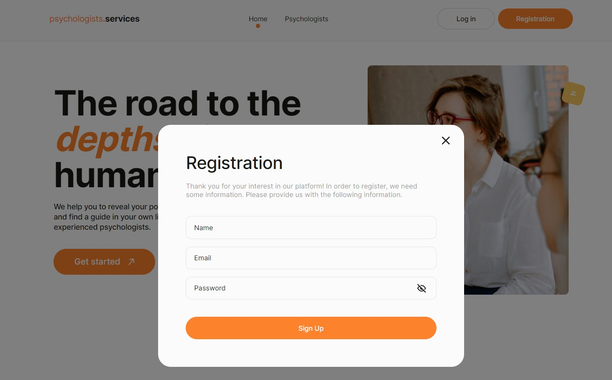
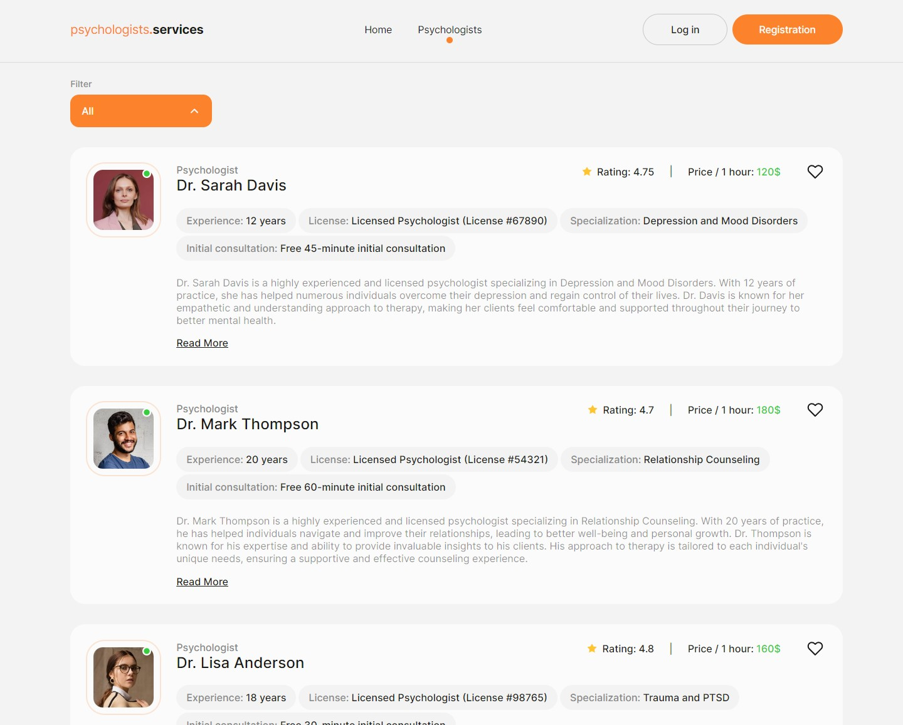
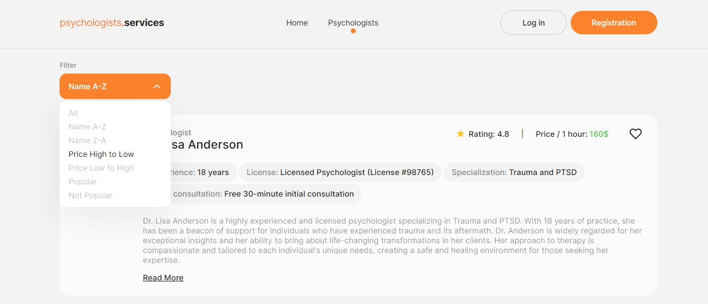
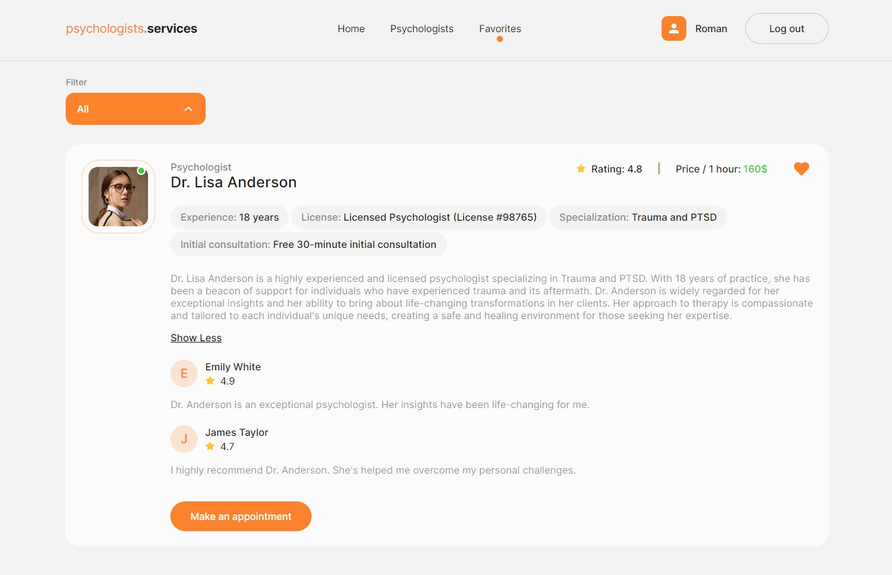
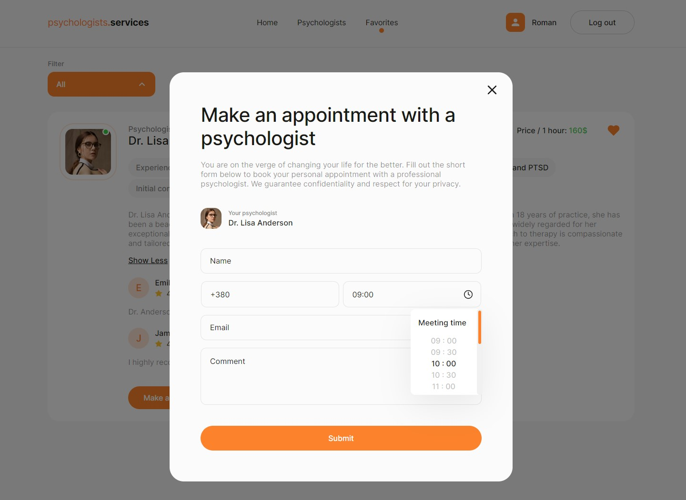

# Psychologist Services

## Project Overview

"Psychologist Services" is a web application developed for a company offering
professional psychological services. The application allows users to search,
sort, add psychologists to favorites, and book consultations. The main goal of
the project is to simplify the process of finding and selecting a psychologist
by providing a convenient and intuitive interface.

## Pages and Their Content

1. ### **Home**

- **Site Header:** Company name.
- **Company Slogan:** A brief description of the company's mission.
- **Get Started Link:** A button that redirects to the "Psychologists" page.

2. ### **Psychologists**

- **List of Psychologists:** A list of cards with information about
  psychologists.
- **Sorting Filters:** Ability to sort by alphabet, price, and popularity.
- **Psychologist Cards:** Brief descriptions, ratings, prices, work experience,
  and other characteristics.
- **Load More Button:** Load additional psychologist cards on request.

3. ### **Favorites**

- **List of Favorite Psychologists:** Cards of psychologists added to favorites
  by the user.
- **Add/Remove Functionality:** Ability to manage favorite psychologists.

## Technical Specifications

- Authentication: Implemented using Firebase Authentication (registration,
  login, logout, and retrieving current user data).
- Data Handling: Storing psychologist data in Firebase Realtime Database.
- Form Validation: Using react-hook-form and yup for form creation and
  validation.
- Sorting and Filtering: Functions to sort and filter the list of psychologists.
- Local Storage: Using localStorage to store favorite psychologists.

## Features

- Registration and Login: Users can register and log in to access additional
  features.
- View Psychologists: Ability to view and sort the list of psychologists.
- Add to Favorites: Authenticated users can add psychologists to their
  favorites.
- Book a Consultation: Ability to send a request for a personal meeting with a
  psychologist.
- Manage Favorites: Manage the list of favorite psychologists (add/remove).

## Technologies Used

- Frontend: React, React Router Dom, Styled-components
- State Management: Redux Toolkit
- Forms and Validation: React Hook Form, Yup
- Libraries: Axios, React-toastify, React-spinners, React-burger-menu
- Authentication and Database: Firebase Authentication, Firebase Realtime
  Database
- Build and Deployment: Vite, GitHub Pages, Netlify

## Libraries Used

- @hookform/resolvers
- @reduxjs/toolkit
- @testing-library/jest-dom
- @testing-library/react
- @testing-library/user-event
- axios
- dotenv
- firebase
- modern-normalize
- react
- react-burger-menu
- react-dom
- react-hook-form
- react-redux
- react-router-dom
- react-scripts
- react-spinners
- react-toastify
- redux
- styled-components
- web-vitals
- yup

The project provides an intuitive interface for searching and selecting
psychologists, ensuring high interactivity and ease of use. The implemented
features and technologies make it a modern and reliable tool for users.

